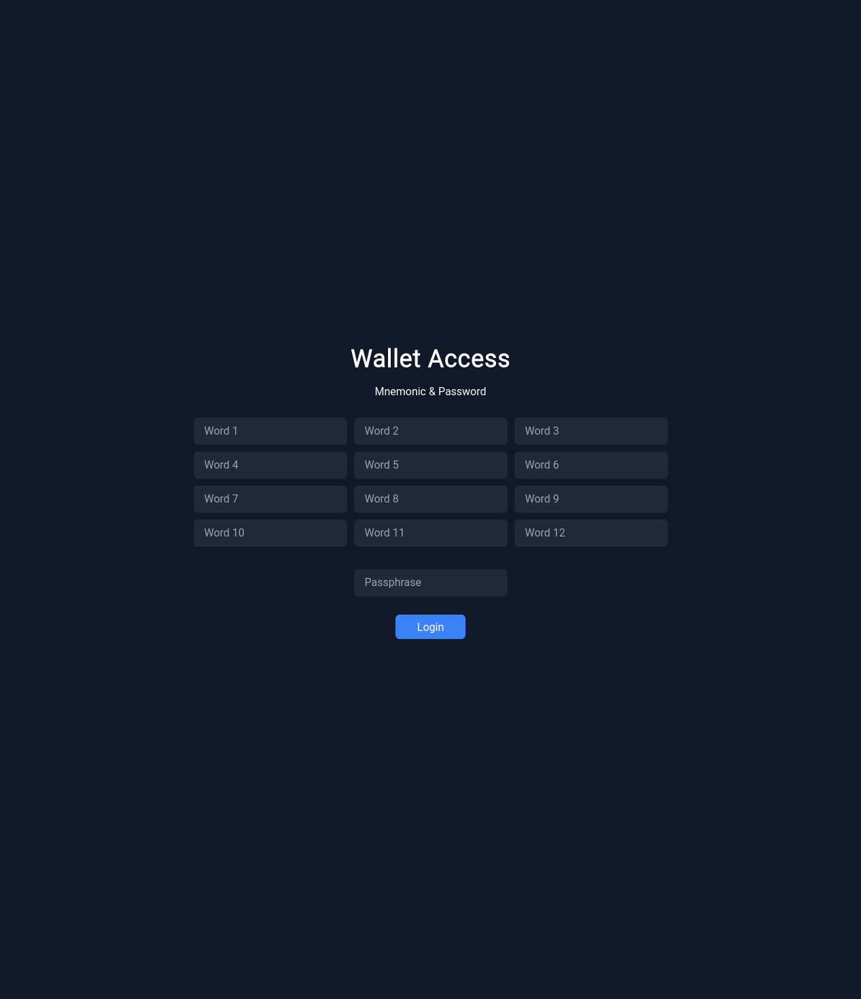

# [WIP] Web3



## Installation

```bash
$ bun install
```

## Development

Install pre-commit:

```shell
$ python -m venv venv
$ venv/bib/activate
$ pip install pre-commit
$ pre-commit install
```

Run Ganache + Server:

```shell
$ docker compose up ganache
$ bun run dev
```

## Test

### Unit

```shell
$ docker compose up ganache
$ bun run jest
```

### End-to-End

```shell
$ bun run playwright install
$ docker compose up --build
$ bun run playwright test
```
