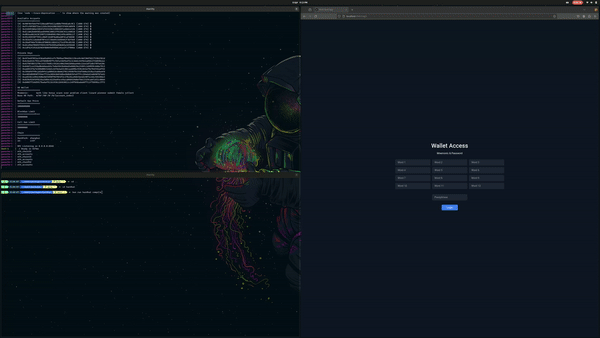

# Web3

A project to learn more about the Web3 development ecosystem. The project has two packages: Hardhat & NextJS.

**Hardhat**

The Hardhat project contains a Voting Contract sample which allows the Users to vote for an Option. It uses Chai to test the Contract, ESLint to lint the TS code, Solhint to lint Solidity code and Biome to format the code.

**NextJS**

The NextJS project contains the code to unlock the Ganache generated accounts, send a transaction to another account and deploy a Contract. It uses Jest and Playwright to test the web page, ESLint to lint the TS code and Biome to format the code.

<br>
<br>
<p align="center">
  
</p>


## Development

Install pre-commit:

```shell
$ python -m venv venv
$ venv/bib/activate
$ pip install pre-commit
$ pre-commit install
```

## Packages

### Hardhat

Use the Hardhat package directory:

```bash
$ cd package/hardhat
```

#### Installation

```bash
$ bun install
```

#### Test

```shell
$ bun run hardhat test
```

#### Compile

```shell
$ bun run hardhat compile
```

### NextJS

Use the Hardhat package directory:

```bash
$ cd package/nextjs
```

#### Installation

```bash
$ bun install
```

#### Execution

Run Ganache + Server:

```shell
$ docker compose up ganache
$ bun run dev
# Or
$ docker compose up --build
```

#### Test

**Unit**

```shell
$ docker compose up ganache
$ bun run jest
```

**End-to-End**

```shell
$ bun run playwright install
$ docker compose up --build
$ bun run playwright test
```
